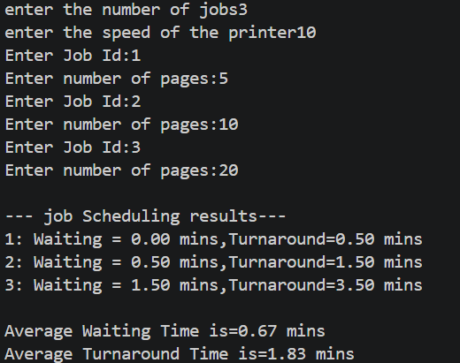

# Printer Job Scheduling System

This Java program calculates:
- Waiting Time
- Turnaround Time

for multiple print jobs based on printer speed.

## Features
- User input for jobs and pages
- Calculates execution time
- Displays waiting and turnaround time
- Computes average times

## How to Run
1. Compile:
   javac Project.java
2. Run:
   java Project

## Sample Output

## Concepts Used
- Arrays
- Loops
- Scheduling logic (FCFS)
